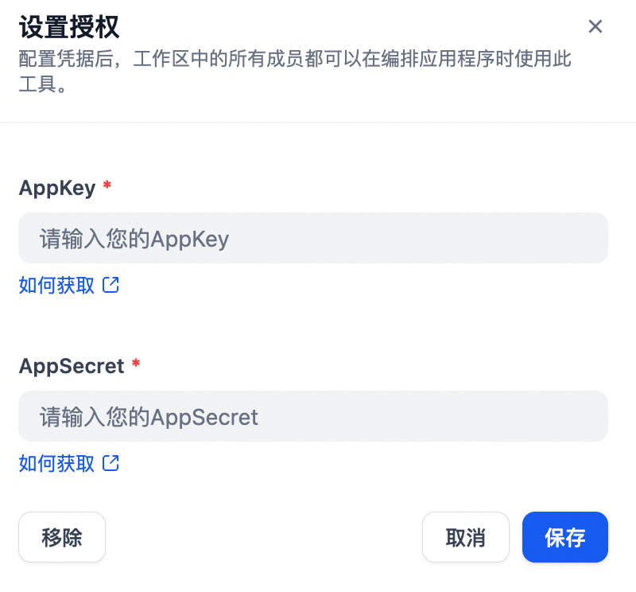

## dingtalk_yida

**Author:** yida
**Version:** 0.0.1
**Type:** tool

### Description

This plugin is provided by the official DingTalk Yida team and is based on the Yida OpenAPI. It offers features for adding, deleting, retrieving, and updating Yida form instance data. All data will only be used to call the Yida API, so you can use it with confidence. Official Yida OpenAPI documentation: https://open.dingtalk.com/document/orgapp/overview-yida

### Configuration

1. You need to obtain your AppKey and AppSecret from the DingTalk Developer Console. For more details, please refer to the [DingTalk Developer Platform Documentation](https://open.dingtalk.com/document/orgapp/obtain-the-access_token-of-an-internal-app).
2. In the authorization settings interface, enter the AppKey and AppSecret and save them.
   
3. Now you can freely use the tool. You can refer to the [Yida Application Development](https://open.dingtalk.com/document/orgapp/overview-yida) for the input parameters and functions of each tool.
